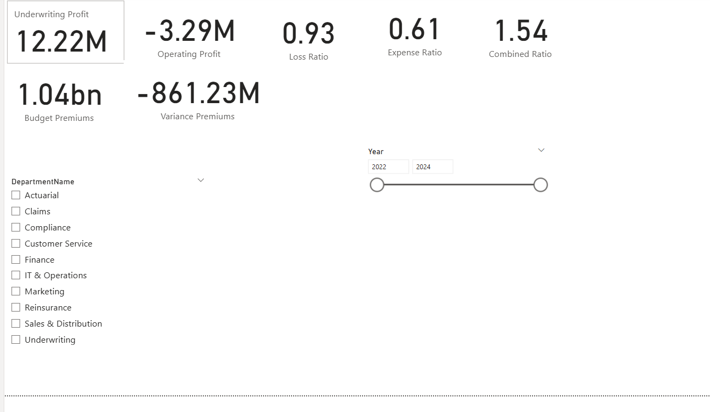
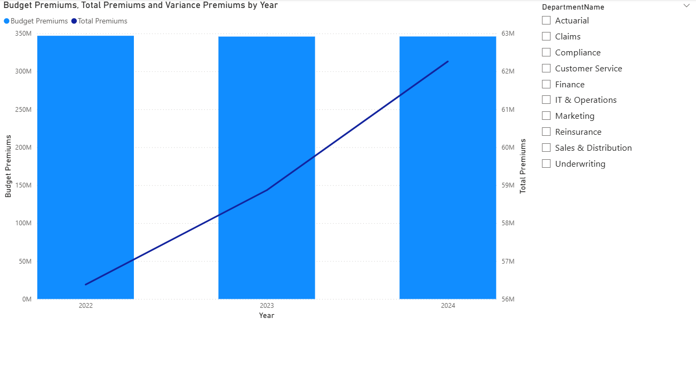
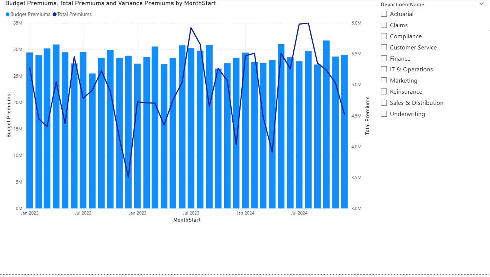
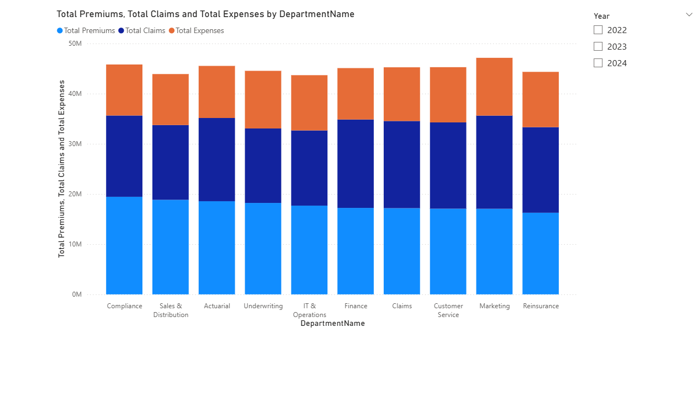

# Insurance Controlling Dashboard

## Overview
This is a multi-page **Power BI dashboard** designed for controlling and reporting in an insurance company context.  
It provides insights into financial metrics such as premiums, claims, expenses, budget vs actual analysis, and department-level breakdowns.  
The dashboard is built using **Power BI Desktop** and uses a **simulated dataset** for demonstration purposes.

---

## Repository Structure

    Insurance_Dashboard/
        dataset_generation.ipynb      # Python code to generate synthetic dataset
        data/
            dim_date.csv   # Simulated financial dataset
            dim_department.csv
            fact_budget.csv
            fact_financials
        Insurance_Controlling_Dashboard.pbix   # Power BI file
        screenshots/
            page1_kpis.png
            page2_trends.png
            page3_budget_vs_actual_1.png
            page3_budget_vs_actual_2.png
            page4_department_breakdown.png
        README.md

---

## Dashboard Pages

### Page 1 – KPI Overview
- High-level financial KPIs:
  - Underwriting Profit
  - Operating Profit
  - Loss Ratio
  - Expense Ratio
  - Combined Ratio
  - Budget vs Actual Premiums
- Interactive slicers:
  - Year
  - Department
- Screenshot:
  

### Page 2 – Trend Analysis
- Line charts showing Total Premiums, Total Claims, Total Expenses by Year
- Slicer for Department to filter trends per department
- Screenshot:
  

### Page 3 – Budget vs Actual
- Line and Clustered Column chart comparing Budget Premiums (columns) vs Total Premiums (line)
- Variance Premiums shown in tooltips
- X-axis: MonthStart (continuous) for monthly trend
- Slicer: Department
- Screenshot:
  
  

### Page 4 – Department Breakdown
- Stacked Column Chart showing Total Premiums, Total Claims, Total Expenses per department
- Slicer: Year
- Useful for drill-down analysis and understanding department-level contributions
- Screenshot:
  

---

## Tools & Technologies
- Power BI Desktop – for dashboard creation
- Python – for generating the simulated dataset
- GitHub – version control and portfolio showcase

---

## How to Use
1. Download or clone the repository
2. Open `Insurance_Controlling_Dashboard.pbix` in Power BI Desktop
3. Explore the four pages using slicers for Year and Department
4. Hover over charts to view tooltips with additional metrics like variance

---

## Notes
- Dataset is simulated for demonstration purposes
- All calculations and measures are built in DAX in Power BI
- You can replace the dataset with real financial data for real-world use

---

