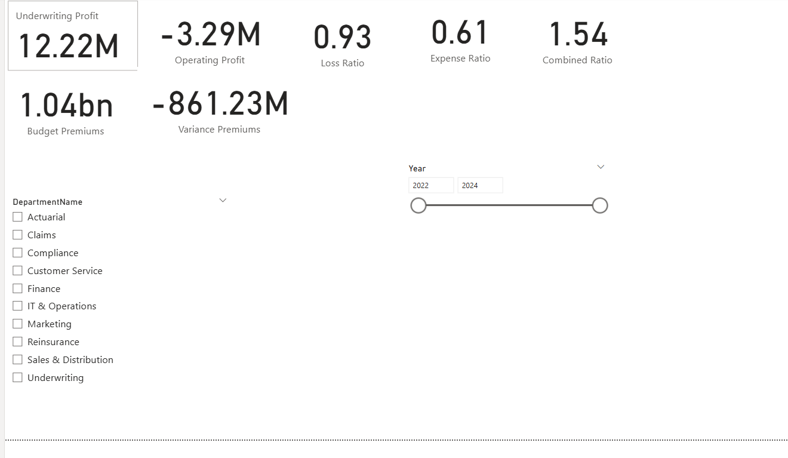
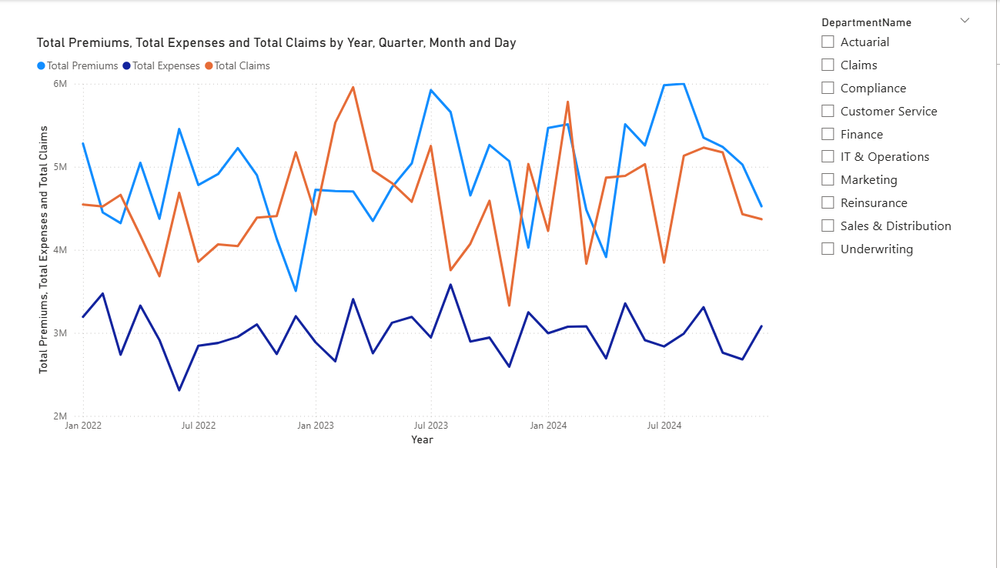
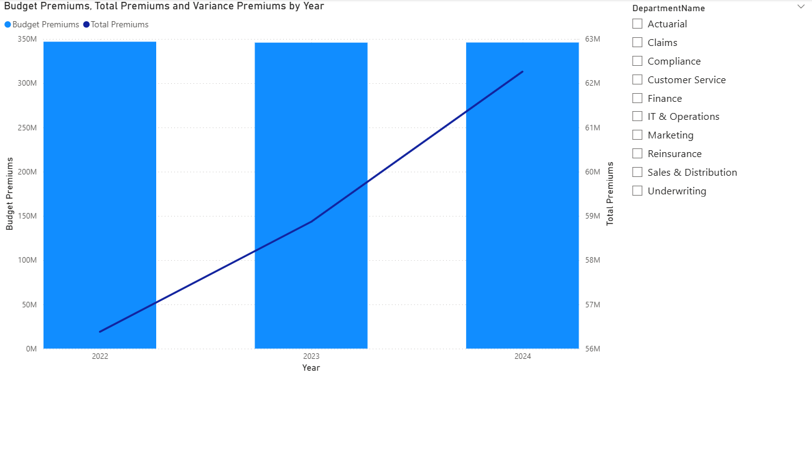
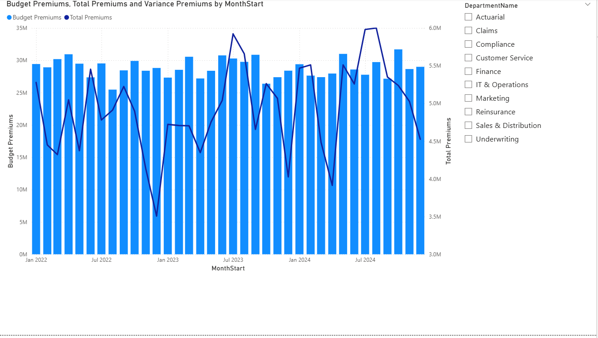
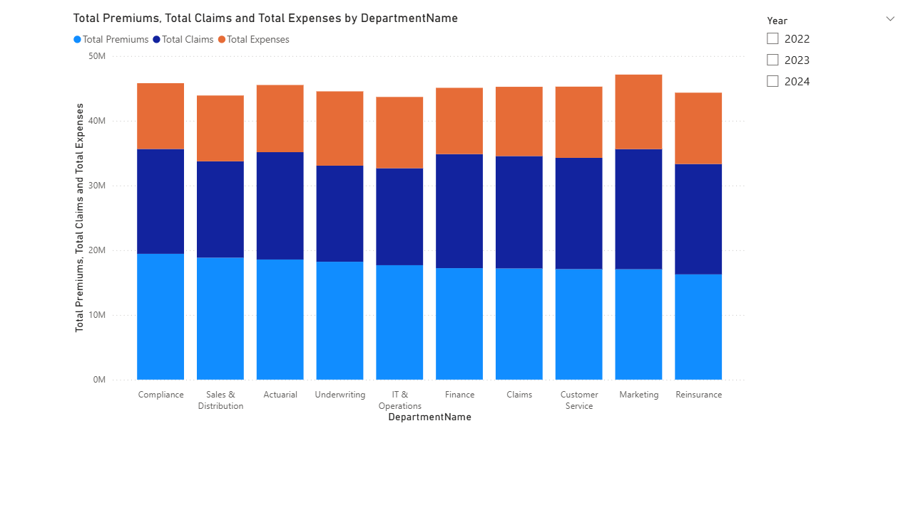

# Insurance Controlling Dashboard

## Overview
This is a multi-page **Power BI dashboard** designed for controlling and reporting in an insurance company context.  
It provides insights into financial metrics such as premiums, claims, expenses, budget vs actual analysis, and department-level breakdowns.  
The dashboard is built using **Power BI Desktop** and uses a **simulated dataset** for demonstration purposes.

---

## Repository Structure

    Insurance_Dashboard/
        dataset_generation.ipynb      # Python code to generate synthetic dataset
        data/
            dim_date.csv   # Simulated financial dataset
            dim_department.csv
            fact_budget.csv
            fact_financials
        Insurance_Controlling_Dashboard.pbix   # Power BI file
        screenshots/
            page1_kpis.png
            page2_trends.png
            page3_budget_vs_actual_1.png
            page3_budget_vs_actual_2.png
            page4_department_breakdown.png
        README.md
        LICENSE

---

## 🧪 Data Engineering & Modeling
Unlike standard dashboards using flat files, this project implements a full **Relational Star Schema**:
- **Synthetic Generation:** Used Python (Jupyter) to engineer 3 years of insurance records, ensuring referential integrity across all tables.
- **Relational Schema:** Implemented a "Star Schema" in Power BI. By connecting two Fact tables (`Actuals` vs. `Budget`) to shared Dimension tables, the dashboard allows for seamless Budget-vs-Actual comparisons.
- **DAX Logic:** Developed custom measures for the **Combined Ratio**, **Loss Ratio**, and **Expense Ratio**, ensuring the calculations remain accurate when drilling down into specific departments.

---

## Dashboard Pages

### Page 1 – KPI Overview
- High-level financial KPIs:
  - Underwriting Profit
  - Operating Profit
  - Loss Ratio
  - Expense Ratio
  - Combined Ratio
  - Budget vs Actual Premiums
- Interactive slicers:
  - Year
  - Department
- Screenshot:
  

### Page 2 – Trend Analysis
- Line charts showing Total Premiums, Total Claims, Total Expenses by Year
- Slicer for Department to filter trends per department
- Screenshot:
  

### Page 3 – Budget vs Actual
- Line and Clustered Column chart comparing Budget Premiums (columns) vs Total Premiums (line)
- Variance Premiums shown in tooltips
- X-axis: MonthStart (continuous) for monthly trend
- Slicer: Department
- Screenshot:
  
  

### Page 4 – Department Breakdown
- Stacked Column Chart showing Total Premiums, Total Claims, Total Expenses per department
- Slicer: Year
- Useful for drill-down analysis and understanding department-level contributions
- Screenshot:
  

---

## 💡 Key Analytical Insights
- **Underwriting Profitability:** The dashboard distinguishes between **Underwriting Profit** and **Operating Profit**, allowing users to see if the core insurance business is covering its operational overhead.
- **Combined Ratio Analysis:** A primary focus is the **Combined Ratio**. In this simulation, identifying ratios above 1.0 (100%) helps management pinpoint departments where claims and expenses exceed earned premiums.
- **Variance Tracking:** The "Budget vs. Actual" page isolates the **-861.2M Variance**, helping controllers identify if the gap is driven by a drop in premiums or an unexpected spike in claims.

---

## Tools & Technologies
- Power BI Desktop – for dashboard creation
- Python – for generating the simulated dataset
- GitHub – version control and portfolio showcase

---

## How to Use
1. Download or clone the repository
2. Open `Insurance_Controlling_Dashboard.pbix` in Power BI Desktop
3. Explore the four pages using slicers for Year and Department
4. Hover over charts to view tooltips with additional metrics like variance

---

## Notes
- Dataset is simulated for demonstration purposes
- All calculations and measures are built in DAX in Power BI
- You can replace the dataset with real financial data for real-world use

---

## 🚀 Future Roadmap (What's Next)
To further enhance the actuarial depth of this tool, I plan to:
1. **Loss Development Triangles:** Implement "Claims Triangles" to visualize IBNR (Incurred But Not Reported) trends over time.
2. **Scenario Simulation:** Integrate a "What-If" parameter to simulate how a 5% increase in premium rates would impact the overall Combined Ratio.
3. **Solvency II View:** Add a dedicated page for monitoring Capital Requirements and Risk-Based Capital (RBC) metrics.

---

